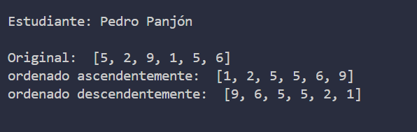

# Estructura de datos

**Estudiante:** Pedro Panjón

## Metodos de Ordenamiento

### Practica 1-2O/Oct

    Metodo Sort Bubble

### Practica 2-21/Oct

    Metodo Sort Selection en java y python

### Arreglo de números enteros

    1. Arreglo de números enteros

### Arreglo de cadenas (nombres)

    2. Arreglo de cadenas (nombres)

### Arreglo de objetos tipo Persona (ordenado por nombre y por edad)

    3. Arreglo de personas ordenado por nombre

    
    4. Arreglo de personas ordenado por edad
