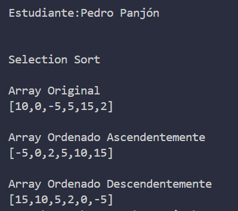

# Estructura de datos

**Estudiante:** Pedro Panjón

## Metodos de Ordenamiento

### Practica 1-2O/Oct

    Metodo Sort Bubble
    

### Practica 2-21/Oct

    Moetodo Sort Selection en java y python
    
